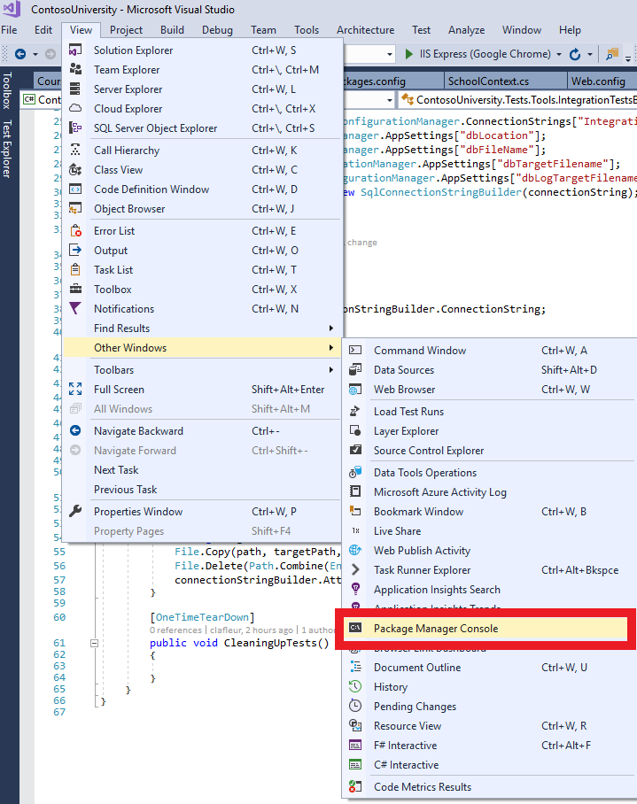

Initialisation de la base de donnée
====

Dans Visual Studio ouvrir le *Package Manager Console*



Executer les commandes suivantes :

```bat
  Enable-Migrations
  Add-Migration Initial
  Update-Database
```


