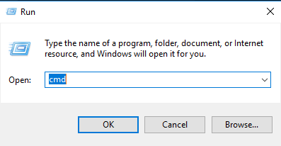

Configuration de LocalDB
====

Ouvrir une invite de commande *Win+R* et taper *cmd* puis ok.



Dans l'invite de commande taper : 
```bat
 sqllocaldb.exe info
```

Si le nom de l'instance *MSSQLLocalDB*, vous n'avez pas besoin d'aller plus loin.

Si ce n'est pas le cas entrez la commande :
```bat
 sqllocaldb.exe create MSSQLLocalDB
```
